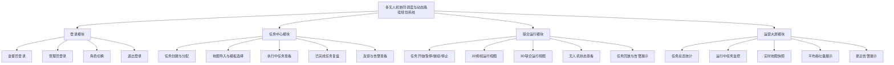

# 当前系统功能模块图（Markdown）

下面这版是“功能模块图”而不是“系统架构图”。因此这里只保留答辩现场可以直接演示、可以被用户感知的功能，不展示后端接口、数据库、事件流或算法内部实现细节。

## 论文里可直接配套说明

从功能展示角度看，本系统可概括为四个一级模块。登录模块负责管理员与监督员双角色登录及切换；任务中心模块负责任务创建、任务分配、地图导入、执行中任务查看以及已完成任务复盘；联合运行模块负责任务执行控制、2D 俯视运行状态展示、3D 联合运行展示以及无人机状态和告警信息查看；运营大屏模块负责系统级任务统计、实时地图快照、平均吞吐量和最近告警的集中展示。这样划分更符合毕业设计答辩中“可演示功能模块图”的表达方式。
