# 当前系统模块图（Markdown）

下面这版模块图参考了你给的样例组织方式：先给出系统总名称，再向下拆分一级功能模块，每个一级模块继续拆分为二级子模块。内容不是按代码目录硬拆，而是按当前项目真实业务能力和系统职责来划分。

```mermaid
flowchart TB
    A["多无人机协同调度与动态路径规划系统"]

    A --> B["登录与身份管理模块"]
    A --> C["任务调度管理模块"]
    A --> D["路径规划与算法运行模块"]
    A --> E["运行监控与可视化模块"]
    A --> F["数据存储与服务支撑模块"]

    B --> B1["监督员登录"]
    B --> B2["管理员登录"]
    B --> B3["登录状态维护"]
    B --> B4["身份信息读取"]

    C --> C1["任务创建与参数配置"]
    C --> C2["地图/模板选择"]
    C --> C3["任务分配与排期"]
    C --> C4["任务控制（开始/暂停/继续/停止）"]
    C --> C5["任务反馈与历史任务管理"]

    D --> D1["全局路径规划"]
    D --> D2["多智能体强化学习推理"]
    D --> D3["样例仿真与模型回放生成"]
    D --> D4["运行状态更新"]
    D --> D5["指标计算（吞吐量/时延/冲突）"]

    E --> E1["任务中心"]
    E --> E2["运营大屏"]
    E --> E3["2D俯视运行视图"]
    E --> E4["3D联合运行视图"]
    E --> E5["告警与回放展示"]

    F --> F1["REST API接口"]
    F --> F2["SSE事件流推送"]
    F --> F3["任务数据库（TaskDB）"]
    F --> F4["任务回放存储"]
    F --> F5["告警与反馈持久化"]
```

## 论文里可直接配套说明

本系统以“多无人机协同调度与动态路径规划”为核心，整体由五个一级模块组成：登录与身份管理模块负责管理员与监督员双角色认证及身份状态维护；任务调度管理模块负责任务创建、地图与模板选择、任务分配排期及任务控制；路径规划与算法运行模块负责全局路径生成、多智能体强化学习推理、样例仿真与运行指标计算；运行监控与可视化模块负责任务中心、运营大屏以及 2D/3D 联合运行视图的展示；数据存储与服务支撑模块负责接口服务、事件推送、任务数据库、回放存储以及告警和反馈的持久化。各模块之间共同构成了一个从“任务创建—算法执行—运行监控—回放复盘”的完整闭环系统。
